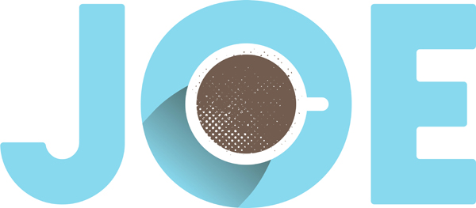

## Joes Coffee Project



Joes Coffee is a sample application that is used by Coveo for onboarding partners. It allows partners to demonstrate their development & resourcefullness skills while learning to do a basic Coveo implementation. Joes Coffee is a fictitious Coffee Shop with a striving community that helps Joe manage his online community for FAQ's and offers them a rich user experience while using Coveo as their main community Search.


## Installation Instructions

-   [Seting up your Environment for JoeCoffee using Salesforce DX](#setting-up-JoeCoffee-using-salesforce-dx): This is the recommended setup. Use this option if you are a developer.
-   [Seting up your Environment for JoeCoffee using a Developer Org](#setting-up-JoeCoffee-using-a-developer-org): This option allows anybody to go through the project.

## Pre-requisites
1. This project assumes you are familair with version control, Git and Github.
    -   In order to get familiar with the basics, follow the steps in the [Git and GitHub Basics](https://trailhead.salesforce.com/en/content/learn/modules/git-and-git-hub-basics) Trailhead module.

## Seting up your Environment for Joes Coffee using Salesforce DX

0. Get Started with Visual Studio Code. Follow the steps in the [Quick Start: Visual Studio Code for Salesforce Development](https://trailhead.salesforce.com/content/learn/projects/quickstart-vscode-salesforce) Trailhead project. The steps include:

-  Install Visual Studio Code
-  Install the Salesforce CLI
-  Use VS Code for Salesforce DEvelopment  

1. Set up your environment. Follow the steps in the [Quick Start: App Development with Salesforce DX](https://trailhead.salesforce.com/en/content/learn/modules/sfdx_app_dev) Trailhead module. The steps include:

-   Salesforce DX
-   Create an App
-   Build an App Using the Salesfsorce CLI
-   Convert and Deploy an Existing App

2. Authenticate with your hub org and provide it with an alias (**myDevHub** in the command below):

```
sfdx force:auth:web:login -d -a myDevHub
```

3. Clone the repository:

```
git clone https://github.com/gminero/joe-coffee.git
cd joe-cofee
```

4. Create a scratch org and provide it with an alias (**joescoffee** in the command below):

```
sfdx force:org:create -s -f config/project-scratch-def.json -a joescoffee
```

5. Under the siteAdmin force-app/main/default/sites/Joes_Coffee.site-meta.xml, Assign your scratchorg's user to the **siteAdmin** XML node 

```
<siteAdmin>SratchOrgUserName</siteAdmin>
```

6. Push the app to your scratch org:

```
sfdx force:source:push
```

7. In **Setup**, under **User**, activate the **Knowledge User** setting for the admin.

8. Ensure that the Sys admin Profile has read/write access to the cusotm fields (origin_url__c, long_summary__c, topic__c)

9. Load sample Data:

```
sfdx force:data:tree:import --plan ./data/sample-data.json
```

10. Open the scratch org:

```
sfdx force:org:open
```


## Seting up your Environment for Joes Coffee using a Developer Org

1. [Sign up](https://developer.salesforce.com/signup) for a Developer Edition (DE) org.

2. Enable MyDomain in your DE org. Instructions to do this are [here](https://trailhead.salesforce.com/modules/identity_login/units/identity_login_my_domain).

3. In **Setup**, under **User**, activate the **Knowledge User** setting..

4. In **Setup**, under **Knowledge**, Enable Lightning Knowledge and create the fields as specified in the project guide.

5. Import Knowledge data Using Salesforce's API after having created the necessary custom fields on the object:

-   Use the Knowledge__cs JSON file from the data folder. 
-   Using Salesforce's API, Upload the data [Lightning Platform API Basics](https://trailhead.salesforce.com/en/content/learn/modules/api_basics).
-   After having uploaded the content, the articles will still need to be published, this can be easily achieved using APEX (or the UI)